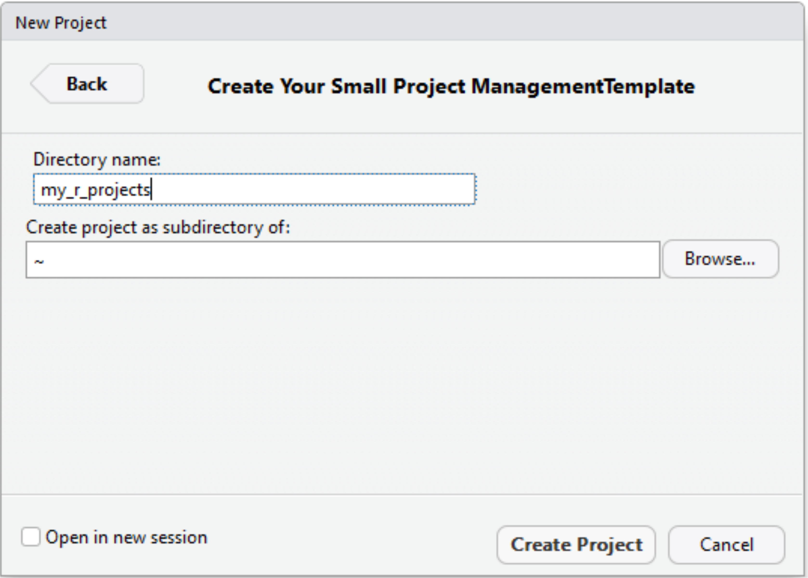

# Your small project management


The 'yspm' package is a project management tool for the famous R statistics
environment. The package provides tools to easily create a predefined project
folder structure, helps to manage relative file and folder references inside a
project and implements version management of dependencies to allow for creating
better reproducible projects in R.

## Installation

In order to work with the project management tool you need to be able building
R packages locally on your computer. It requires the installation of the GNU
software development tools which comprise a C/C++ compiler and LaTeX if you
want to be able building R manuals and vignettes. Below you can find links and
instructions for different operating systems.

* Windows:
    - https://cran.rstudio.com/bin/windows/Rtools/
    - https://miktex.org/download (optional for manuals)

(Make sure you check the option during the installation which ensures the
location of compiler binaries is added to the search path)

* Mac OS X
    - https://itunes.apple.com/us/app/xcode/id497799835?mt=12
    - http://www.tug.org/mactex/downloading.html (optional for manuals)

* Linux
    - That highly depends on your Linux-Distribution. Check out the Wiki
      of your distribution or ask your preferred search engine.

```r
# requires R: 3.5.2
install.packages("devtools", dependencies = TRUE)
devtools::install_github("cpfaff/yspm", subdir = "yspm", dependencies = TRUE)
```

## Getting started

### Setup

#### From an r-script

First you set up a folder where all of your future your future R-projects will
reside in. The `yspm` package assists you with this task (see below). Calling
the function creates the folder of your choice and inside of it a new R file
called `manage_projects.R`.

```r
# syntax
yspm::setup(root_path = <a new folder which will contain all your projects>)

# example (on linux)
yspm::setup(root_path = "~/r_projects")
```

This new file is the basis of your data management. It is filled with some
example content to get you started. Open the file and make sure that you set
the working directory to the new projects folder when working.

```r
r_projects
└── manage_projects.R
```

#### From R-studio

You can also use R-Studio to set up your new project management. This however
requires RStudio in version v1.1.28 or greater to be installed on your
computer. If you meet the requirement just click on:

* File > New Project > New Directory

    There you can select a new template. Watch out for the "Your Small Project
    Management Template" and select it (see image below).


Next you have to fill out a small form providing a folder name that should be
used for all your new R projects and a location this folder should be created
in (see image below).



The process creates the new folder for you and a file `manage_projects.R`
inside of it. Finally, it set the correct working directors and opens the
project management file and you can directly start managing your project from
there.

### Create a new project

From inside the `manage_projects.R` file we can create a new project simply
calling the function below.

```r
create_project(project_name = compile_project_name(first_name = "Your first name",
					           last_name = "Your last name"))
```

It creates a new project folder inside of the current directory using the given
project name. While you can provide any string for a project folder name, here
a constructor function (`compile_project_name()`) is used which takes several
parameters which are processed into a string (see below).

```r
compile_project_name(first_name = "Your first name", last_name = "Your last name"))
[1] "2019-03-22_your_first_name_your_last_name"
```

This helps with a consistent naming of projects and is flexible. You can also
create your own constructors. The only thing you need to ensure is that your
functions returns a single string with the name of the folder that you want.
The content of the parameters of the constructor are also collected into the
metadata of the new project. You will find the information in the metadata
folder inside of your new project in a file called `project.dcf` (see below).

Note. The process to create a new project may take a while as it installs an
independent R environment into your new project. Afterwards you can enable the
new project by executing the function below.

```r
enable_project(project_name = compile_project_name(first_name = "Your first name",
					           last_name = "Your last name"))
```

This will set the working directory, the library path and the correct package
repository to use. Further enabling a package also checks if all packages which
are required by the project are installed. If not they will be installed before
you can use it.

### Project structure

Below you find an overview of the project folder structure with a more detailed
documentation of the folders and files.

NOTE: While you can name all the files in your R project how you want, it is
recommended to follow one naming convention. Here we use small letters only, no
special characters, no trailing and leading white spaces and separate words are
combined with an underscore (i.e. snake_case, e.g. `raw_tree_data.csv`). With
this we also follow the recommendations in the tidyverse [style
guide](https://style.tidyverse.org/). You should also carefully select the
names of your files to best reflect their contents. I know this is hard, but
try it!

* full overview

```
2019-03-22_your_full_name
└── project
    ├── data
    │   ├── 01_primary
    │   ├── 02_interim
    │   └── 03_cleaned
    ├── figure
    │   ├── external
    │   └── scripted
    ├── metadata
    │   ├── dataset
    │   └── project
    │       ├── checkpoint.dcf
    │       ├── license.dcf
    │       └── project.dcf
    ├── report
    │   ├── presentation
    │   ├── publication
    │   └── qualification
    └── source
        ├── library
        │   ├── 01_lib_main.R
        │   ├── 02_lib_import_data.R
        │   ├── 03_lib_clean_data.R
        │   ├── 04_lib_transform_data.R
        │   ├── 05_lib_visualise_data.R
        │   └── 06_lib_model_data.R
        └── workflow
            ├── 00_wf_load_packages.R
            ├── 01_wf_main_script.R
            ├── 02_wf_import_data.R
            ├── 03_wf_clean_data.R
            ├── 04_wf_transform_data.R
            ├── 05_wf_visualise_data.R
            └── 06_wf_model_data.R
```

When a project is enabled you can also issue the function `show_content()` to
create a tree in your R console like the above to get a better overview.

* data

```
2019-02-22_my_full_name
└── project
    ├── data
    │   ├── 01_primary
    │   ├── 02_interim
    │   └── 03_cleaned
```

The data folder is separated into three sub-folders which are prepended with
numbers for a fixed order. The data folder contains all the project related
datasets no matter in which format they are (e.g. tables, images, audio).

1. Primary data

   This folder stores the primary data of your research. That includes e.g.
   data which you just typed in from your field book or data which is not yet
   checked for plausibility and integrity. You should treat this folder as
   write protected. That basically means, non of your R scripts should write
   here.

2. Interim data

   The interim folder is a scratchpad of your data. It can contain e.g. merged
   or partially cleaned datasets. Another use-case is to store intermediate
   data products here which include a long computation to produce them or calls
   to external services. However, data stored in here should disposable. That
   means you should always be able to regenerate the data in here from your
   code.

3. Cleaned data

   The folder contains data which has been thoroughly cleaned, and which is in
   the right shape for your analysis. You should always be able to dispose the
   data in here and regenerate from the raw data by executing your R script

* figure

The figures directory is the place which contains all the figures may they be
created by yourself or taken from somewhere externally.

```
2019-02-22_my_full_name
└── project
    ├── figure
    │   ├── external
    │   └── scripted

```

The figure folder is divided in two sub-folders.

1. external

    Place all figures in here which have not been generated by R itself and are
    essential for the report part of your project.

2. scripted

    This folder stores figures crated by your R script.

* metadata

```
2019-02-22_my_full_name
└── project
    ├── metadata
    │   ├── dataset
    │   └── project
    │       ├── checkpoint.dcf
    │       ├── license.dcf
    │       └── project.dcf
```

The metadata folder is divided into two sub-folders which store

1. dataset

   Information about the datasets in your project. You can use the function
   `collect_csv_metadata()` to collect information about your datasets. It
   will place two files (variables and categories) in here in CSV format that
   you can complement with metadata. In case you have to change something in
   the data you can call it again and it will update your metadata preserving
   what you already described (you can use the alias: `update_csv_metadata()`
   as well).

   The variable file:

   Here information on variable level is resolved. You can add information like
   units and a generic description.

   | file_id | file_name | variable_name | variable_class | missing_values | variable_category | variable_unit | variable_description     |
   | ------- | --------- | ------------- | -------------- | -------------- | ----------------- | ------------- | --------------------     |
   | 1       | iris.csv  | Petal.Length  | numeric        | 0              | NA                | cm            | The length of the petals |
   | 1       | ...       | ...           | ...            | ...            | ...               | ...           | ...                      |
   | ...     | ...       | ...           | ...            | ...            | ...               | ...           | ...                      |


   The category file:

   Here information on category level is resolved. You can add information
   like a generic description. This can help to understand what each of your
   categories actually means.

   | file_id | file_name |  variable_name | variable_category | variable_description |
   | ------- | --------- |  ------------- | --------------    | -------------------- |
   | 1       | iris.csv  |  Species       | setosa            | The setosa species   |
   | 1       | iris.csv  |  ...           | ...               | ...                  |
   | 1       | ...       |  ...           | ...               | ...                  |


2.project

   The project folder contains information about the project. The files are in
   Debian control file format (dcf). It is a structured text file natively
   supported by the R environment and used in many places like e.g. the
   description of R packages.

   This folder holds e.g. a license (currently defaults to CCBYSA 4.0), the
   author of the project and the creation time of the project but also the date
   used to pin package versions (checkpoint).

   The `project.dcf` file:

```r
project_date: 2019-03-22
first_name: Claas-Thido
last_name: Pfaff
...
```

  Now you might ask yourself how that information gets in here. It is filled in
  during the creation. Do you remember the function call from above. If we
  create the project like so...

   ```r
   create_project(project_name = compile_project_name(first_name = "Claas-Thido",
                                                      last_name = "Pfaff"))
   ```

  The parameters of the constructor function for the `project_name` are used as
  fields and the values you passed in are the corresponding values in this
  key-value file. NOTE: This form of collection only works if you use a
  constructor function otherwise the metadata will be empty.

* report

```
2019-02-22_my_full_name
└── project
    ├── report
    │   ├── presentation
    │   ├── publication
    │   └── qualification
```

The report folder is separated into three sub-folders which are pretty much
self explaining. Put your presentations or publications which are related to
this project into the respective folders. In case the project is qualification
work put the document into that folder. Do not put anything else here only the
documents in office format and as pdf.

* source

```
2019-02-22_your_full_name
└── project
    └── source
        ├── library
        │   ├── 01_lib_main.R
        │   ├── 02_lib_import_data.R
        │   ├── 03_lib_clean_data.R
        │   ├── 04_lib_transform_data.R
        │   ├── 05_lib_visualise_data.R
        │   └── 06_lib_model_data.R
        └── workflow
            ├── 00_wf_load_packages.R
            ├── 01_wf_main_script.R
            ├── 02_wf_import_data.R
            ├── 03_wf_clean_data.R
            ├── 04_wf_transform_data.R
            ├── 05_wf_visualise_data.R
            └── 06_wf_model_data.R
```

The source folder is separated into two sub-folders. It is the place which
stores all external (e.g. libraries) and internal source code (your scripts and
functions). If you install a package it goes here. If you load a library it
goes here. If you analyse data it goes here.

* source > library

```
2019-02-22_your_full_name
└── project
    └── source
        ├── library
        │   ├── 01_lib_main.R
        │   ├── 02_lib_import_data.R
        │   ├── 03_lib_clean_data.R
        │   ├── 04_lib_transform_data.R
        │   ├── 05_lib_visualise_data.R
        │   └── 06_lib_model_data.R
```

When you have to copy and paste code more than 2 times in one of your scripts,
then you should consider creating a function so you can reuse it across your
project. These functions go into the files in the library folder (your personal
library of functions). The separate files in here are prepended with numbers
for a logical ordering. The files are named after typical stages of a
scientific data analysis workflow. You can use the default files to
organize your own functions a little bit. Then you can source the files in each
of the files in the workflow folder where the functionality is needed.

* source > workflow

```
2019-02-22_my_full_name
└── project
    └── source
        └── workflow
            ├── 00_wf_load_packages.R
            ├── 01_wf_main_script.R
            ├── 02_wf_import_data.R
            ├── 03_wf_clean_data.R
            ├── 04_wf_transform_data.R
            ├── 05_wf_visualise_data.R
            └── 06_wf_model_data.R
```

The workflow folder contains your complete analysis script. The separate files
in here are prepended with numbers for an ordering. The files are named after
typical stages of a scientific data analysis workflow. You can use the files to
organized your script. For references in between the files there is also a
convenient function called `project_content()` (see description below).

The `yspm` project management tool helps you manage the external dependencies
of your project. In any of your scripts in the source folder you can reference
R libraries. This typically is done using the function `library(<package>)`, or
`require(<package>)`. If you add a new library call to a project source file,
you can run the function `install_dependencies()` from your project management
file. It screens all project script files and ensures that all packages that are
reference are installed.

### References

One problem when sharing R code is the paths it contains. The likelihood that
these are working on another computer is 0%. Thus `setwd()` calls in scripts
should be prevented. The `yspm` provides a function to reference content in a
project which will always work when the tool is setup and the particular
project is activated (like explained above). For example if the project
`2019-02-22_my_full_name` is activated from your `manage_projects.R` file then
the function `reference_content()` will use that folder as root to construct
paths. As each project contains a folder named `project` the function also adds
`project` to the path for you.

Lets say we want to source one of the `02_wf_import_data.R` file from the
source folder in the `01_wf_main_script.R` file in the workflow folder to
import the functions into our workflow.

```
2019-02-22_your_full_name
└── project
    └── source
        ├── library
        │   ├── 01_lib_main.R
        │   ├── 02_lib_import_data.R
        │   ├── 03_lib_clean_data.R
        │   ├── 04_lib_transform_data.R
        │   ├── 05_lib_visualise_data.R
        │   └── 06_lib_model_data.R
        └── workflow
            ├── 00_wf_load_packages.R
            ├── 01_wf_main_script.R
            ├── 02_wf_import_data.R
            ├── 03_wf_clean_data.R
            ├── 04_wf_transform_data.R
            ├── 05_wf_visualise_data.R
            └── 06_wf_model_data.R
```

Then we add the following line to our `01_wf_main_script.R` file

```
2019-02-22_your_full_name
└── project
    └── source
        ├── library
        │   ├── 01_lib_main.R
        │   ├── 02_lib_import_data.R
        │   ├── 03_lib_clean_data.R
        │   ├── 04_lib_transform_data.R
        │   ├── 05_lib_visualise_data.R
        │   └── 06_lib_model_data.R
        └── workflow
            ├── 00_wf_load_packages.R
            ├── 01_wf_main_script.R

            ... file content ...

            source(project_content("source/library/02_wf_import_data.R"))

            ...
```

Which turns into:

```r
source("2019-02-22_my_full_name/project/library/03_wf_import_data.R"))
```

## Code-Styling

The `yspm` R package installs the styler package for R and thus allows you to
easily check and correct your source code to follow the tidyverse style guide
which you can find [here](https://style.tidyverse.org/). Just issue the command
`standardize_project_code()` when a project is enabled and it will run the code
check across all the R files in the project. This corrects e.g. lines which are
to long, replaces equal character for assignment against the arrow (`<-`) and
ensures correct spacing around parentheses and operators.

## Naming helper

During an analysis often data products need to be saved. The `yspm` package
provides convenient constructors functions which help to compile consistent
names for the content in your project folder structure.

Plots:

```r
compile_plot_filename(name = "01I-am-not sure what I amDoing", ext = "PNG")

"2019-03-22_claas_thido_pfaff/project/figure/scripted/01_i_am_not_sure_what_i_am_doing_doc.png"
```

Datasets:

...

## More to come

Check out the [issues](https://github.com/cpfaff/yspm/issues) page of this
project. There you can find currently open ideas or problems. You can easily
contribute, provide suggestions or bug reports there. The only thing you need
is a GitHub [account](https://github.com/join).
